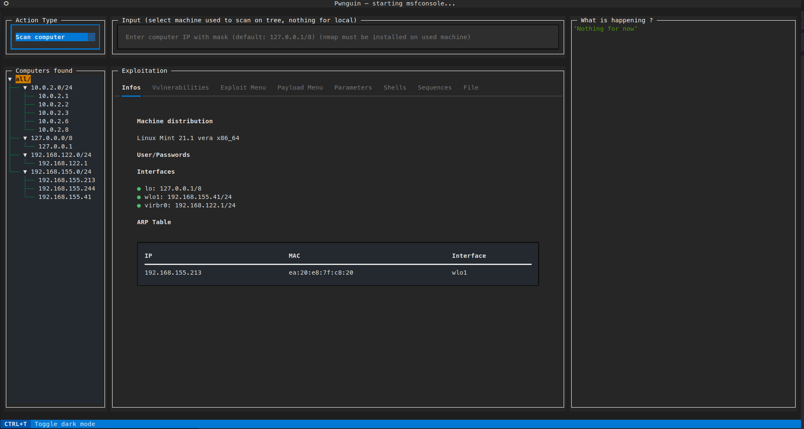
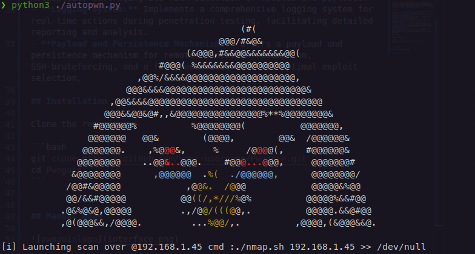

# Pwnguin - Python-based Penetration Testing Tool


## Overview

"Pwnguin" is a Python-based penetration testing tool designed to streamline and enhance various aspects of the penetration testing workflow. By integrating key components from established tools such as Nmap, Exploit-DB, and Metasploit, "Pwnguin" provides penetration testers with a unified and efficient platform.

## Features

- **Integrated Tools:** Seamlessly combines Nmap, Exploit-DB, and Metasploit for comprehensive penetration testing.
- **Textual Interface:** A refined command-line interface optimized for enhanced user accessibility.
- **Network Reconnaissance:** Utilizes Nmap for in-depth network scanning to aid vulnerability identification.
- **Exploit Capabilities:** Interfaces with Exploit-DB for access to an extensive repository of exploits, enhancing its exploit functionalities.
- **Metasploit Integration:** Enables seamless interaction with Metasploit, leveraging its rich selection of modules and payloads.
- **Logging System:** Implements a comprehensive logging system for real-time actions during penetration testing, facilitating detailed reporting and analysis.
- **Payload and Persistence Mechanism:** Offers a payload and persistence mechanism for remote connection resumption, SSH-bruteforcing, and a fully automatic mode for optimal exploit selection.

## Installation

**Disclaimer:**

Before using "Pwnguin," ensure that the following tools are installed on your system:

1. **Nmap:** Network scanning tool. Install from [https://nmap.org/](https://nmap.org/).

2. **Searchsploit:** Part of Exploit-DB, used for searching and retrieving exploits. Install from [https://www.exploit-db.com/searchsploit](https://www.exploit-db.com/searchsploit).

3. **Metasploit Framework:** Penetration testing framework. Install from [https://www.metasploit.com/](https://www.metasploit.com/).

Clone the repository:

```bash
git clone https://github.com/kiso6/pwnguin
cd pwnguin
```

Install dependencies:

```bash
pip install -r requirements.txt
```

## Usage

### Manual mode



```bash
cd pwnguin/modules
python3 interface.py
```

### Automatic mode



```bash
cd pwnguin/modules
python3 autopwn.py
```
